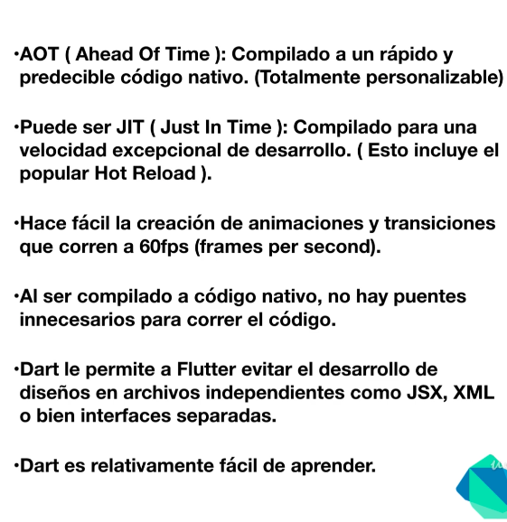

# Flutter Course

> Flutter Course is based on [Flutter: Tu guía completa de desarrollo para IOS y Android](https://www.udemy.com/course/flutter-ios-android-fernando-herrera/)

## ❗️ Requirements

- Dart >= 2.9.3

## ⬇️ Version

1.0.0

## 🛠 Installation

Download zip file and extract it [latest release](https://github.com/reysmerwvr/flutter-course). Or clone the repository and cd into it.

flutter-course uses a number of open source projects to work properly:

- [Dart] - Dart

## 🚀 Running Dart Examples

[dartlang](https://dartpad.dartlang.org/)

## Meta

Reysmer Valle – [@ReysmerWVR]

## License

Flutter Course is (c) 2020 Reysmer Valle ([@ReysmerWVR]) and may be freely distributed under the [license-url](LICENSE). See the `MIT-LICENSE` file.

### 📝 Todos

- [ ] Write tests
- [ ] Add code comments

[//]: # (These are reference links used in the body of this note and get stripped out when the markdown processor does
its job. There is no need to format nicely because it shouldn't be seen. Thanks SO - http://stackoverflow.com/questions/4823468/store-comments-in-markdown-syntax)

   [Dart]: <https://dart.dev/>
   [@ReysmerWVR]: <http://twitter.com/ReysmerWVR>
